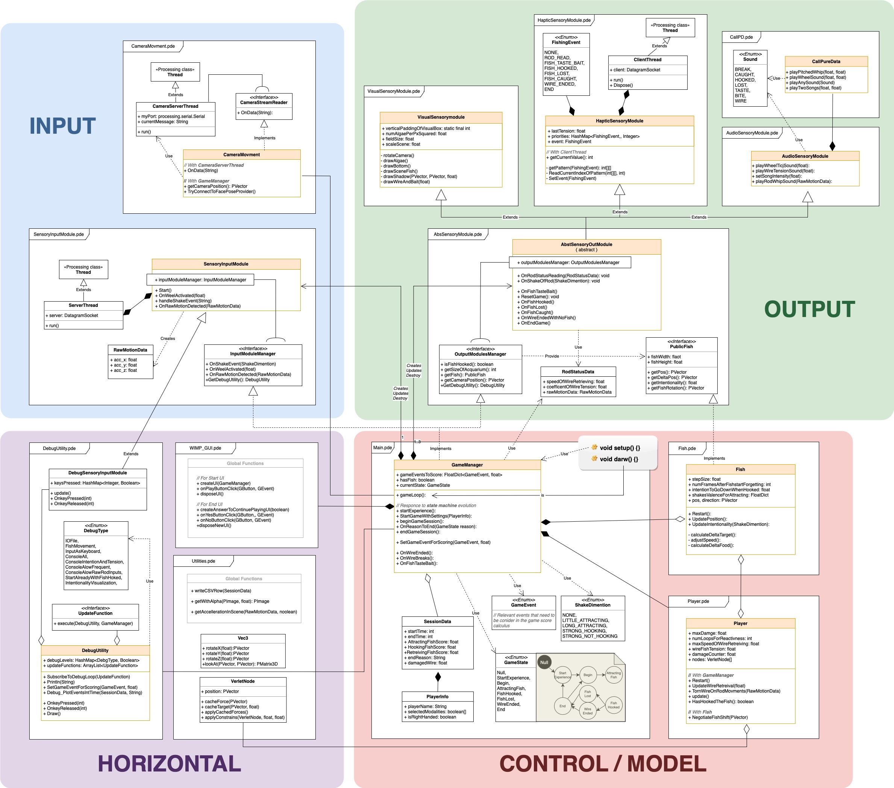

# MultisensoryFishingRod

<p align="center">
  
</p>


## Guide to use the Module Face2Camera movement 

### Download models
Because of the dimentions of the file of the models, you need to download manually the files and import the im the model:
1) Download the files at the link: [https://www.dropbox.com/sh/o8g1530jle17spa/AADRntSHl_jLInmrmSwsX-Qsa?dl=0](https://www.dropbox.com/sh/o8g1530jle17spa/AADRntSHl_jLInmrmSwsX-Qsa?dl=0), keep and use only the ones with .dat extention
2) Move the files at the position: ```MultisensoryFishingPython\OpenFace_2.2.0_win_x64\model\patch_experts``` (From the root of the project)
You can find further information at the link: [https://github.com/TadasBaltrusaitis/OpenFace/wiki/Model-download](OpenFace2.0 Model download). If you are forking the prject feel free to add them in the cloned repository at the position mentioned before. All those files are added in the .gitignore

### Serial ports
Check if you have active the serial pair of ports (even virtual) COM1 & COM2
If you have Windows 10 or Windows 11 they are not available, that's why you need to create a virtual pair of serial ports. You can do it with the free software:
[https://www.hhdsoftware.com/virtual-serial-port-tools](www.hhdsoftware.com)

### Install dependencies 
Run the .bat file in the Root called: install_dipendencies.bat

### Run Main program
Remember to activate the webcam first
Run the .bat file in the Root called: Main.bat

### Exit
Digit "q" in the consoles opened
